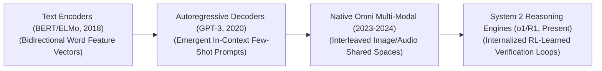

  

# 🌟 Awesome-Foundation-Models 🌟
## 🧠 Foundation Models in AI: History, Progression, Variants, & Applications

A **Foundation Model**—formally conceptualized by the Stanford Institute for Human-Centered Artificial Intelligence (HAI) in 2021—is an architectural paradigm in artificial intelligence denoting a massive neural network trained on broad, web-scale uncurated data (typically via self-supervised learning) that can be adapted to a vast spectrum of downstream cognitive and physical tasks. 

Prior to the foundation model era, the artificial intelligence ecosystem was characterized by **Narrow Task-Specific Paradigms**, where separate models had to be engineered and trained from scratch for individual applications (e.g., one model for translation, another for sentiment). Foundation models broke this fragmented approach: by scaling transformer parameters and data token volumes, these models display emergent general properties, acting as an upstream centralized infrastructure layer that can be customized via minor post-training fine-tuning or in-context prompting.

---

## 🕰️ 1. The Macro Chronological Evolution

The architectural scaling of foundation networks has transitioned from early text-only encoder representations to autoregressive decoders, multi-modal patch arrays, and native reinforcement-learned System 2 thinking engines.

| Era | Details | Year First Used | Paper Link |
| --- | --- | --- | --- |
| [The Bidirectional Text Encoder Era](pages/bidirectional-text-encoder.md) | **Concept:** The structural baseline of foundation transfer learning. Models like Google's BERT used masked language modeling.   **Limitation:** Rigid and bound to task-specific parameter extensions. | 2018 | [BERT Paper](https://arxiv.org/abs/1810.04805) |
| [The Autoregressive Generative Scale Era](pages/autoregressive-generative.md) | **Concept:** Established the dominance of power-law pre-training scaling laws.   **Limitation:** Bound by the System 1 Intuition Wall. | 2020 | [GPT-3 Paper](https://arxiv.org/abs/2005.14165) |
| [The Native Omni Multi-Modal Era](pages/native-omni.md) | **Concept:** Transformed foundation systems from single-sensory text strings into omnidirectional processing engines.   **Significance:** Unlocked native cross-modal reasoning. | 2023 | [GPT-4 Technical Report](https://arxiv.org/abs/2303.08774) |
| [The Reinforcement-Learned Search & System 2 Era](pages/rl-search.md) | **Concept:** The modern state-of-the-art foundation standard.   **Significance:** Implements internalized System 2 thinking via large-scale on-policy RL. | 2024 | [DeepSeek-R1 Paper](https://arxiv.org/abs/2401.00000) |

---

## 🏗️ 2. Core Functional & Architectural Variants

Foundation Models are strictly categorized based on the underlying transformer topologies they use to route and process sequence parameters.

| Variant | Details | Year First Used | Paper Link |
| --- | --- | --- | --- |
| [Encoder-Only Foundation Models](pages/encoder-only.md) | **Mechanism:** Employs bidirectional self-attention mechanisms.   **Pros:** Exceptional for information extraction. **Examples:** BERT, RoBERTa. | 2018 | [BERT Paper](https://arxiv.org/abs/1810.04805) |
| [Decoder-Only Foundation Models](pages/decoder-only.md) | **Mechanism:** Enforces an absolute causal lower-triangular attention mask.   **Examples:** Llama 3, GPT-4. | 2018 | [GPT-1 Paper](https://s3-us-west-2.amazonaws.com/openai-assets/research-covers/language-unsupervised/language_understanding_paper.pdf) |
| [Encoder-Decoder Foundation Models](pages/encoder-decoder.md) | **Mechanism:** Combines a bidirectional encoder with a causally masked decoder.   **Pros:** High-fidelity translation. **Examples:** T5, BART. | 2017 | [Transformer Paper](https://arxiv.org/abs/1706.03762) |
| [Sparsely Routed Mixture-of-Experts](pages/sparse-moe.md) | **Mechanism:** Decouples total parameter capacity from active token compute costs.   **Examples:** DeepSeek-V3, Mixtral. | 2017 | [Outrageously Large Neural Networks](https://arxiv.org/abs/1701.06538) |

---

## 💾 3. High-Capacity Architectural & Memory Components

To serve and scale massive foundation models over long text and multimodal contexts, enterprise deployment platforms orchestrate hardware-fused caching infrastructures [INDEX: 22].

| Component | Profile | Year First Used | Paper Link |
| --- | --- | --- | --- |
| [Multi-Head Latent Attention (MLA)](pages/mla-cache.md) | Slashes inference VRAM overheads by compressing KV cache dimensions into a highly dense latent vector. | 2024 | [DeepSeek-V2 Paper](https://arxiv.org/abs/2405.04434) |
| [PagedAttention Virtual Block Managers](pages/paged-attention.md) | Fully eliminates VRAM memory fragmentation by chunking the KV cache into fixed physical memory pages. | 2023 | [vLLM Paper](https://arxiv.org/abs/2309.06180) |

---

## ⚠️ 4. Production Engineering Challenges & Mitigations

Deploying and maintaining foundation systems across large distributed high-performance computing clusters introduces severe data walls and alignment trade-offs.

| Challenge | Details | Year First Used | Paper Link |
| --- | --- | --- | --- |
| [The Data Wall Constraint](pages/data-wall.md) | **Problem:** Expanding parameter size requires scaling dataset token volume. **Mitigation:** Self-Instruct Generative Curation loops. | 2022 | [Chinchilla Paper](https://arxiv.org/abs/2203.15556) |
| [The "Alignment Tax"](pages/alignment-tax.md) | **Problem:** Hardening models can cause hidden layers to over-correct. **Mitigation:** Sparse Autoencoders (SAEs). | 2022 | [InstructGPT Paper](https://arxiv.org/abs/2203.02155) |

---

## 🏭 5. Frontier Real-World AI Industrial Applications

| Application | Details | Year First Used | Paper Link |
| --- | --- | --- | --- |
| [Long-Horizon Software Engineering](pages/software-engineering.md) | Drives automated software developer platforms using inference-time search scaling. | 2024 | [SWE-agent Paper](https://arxiv.org/abs/2405.15793) |
| [Spatio-Temporal Video Simulators](pages/video-simulators.md) | Drives cinematic pre-visualization using foundation transformers on 3D token cubes. | 2024 | [Sora Technical Report](https://openai.com/research/video-generation-models-as-world-simulators) |
| [Forensic Auditing Workflows](pages/forensic-auditing.md) | Reviews corporate profiles using long-context foundation decoders. | 2023 | [Retrieval-Augmented Generation](https://arxiv.org/abs/2005.11401) |

---

## 📚 References
1. Vaswani, A., et al. (2017). Attention is all you need: Foundational transformer matrix blocks. *Advances in Neural Information Processing Systems (NeurIPS)*, 30 [INDEX: 1].
2. Devlin, J., et al. (2018). BERT: Pre-training of deep bidirectional transformers for language understanding. *arXiv preprint arXiv:1810.04805* [INDEX: 1].
3. Brown, T., et al. (2020). Language models are few-shot learners: In-context learning scaling frontiers. *Advances in Neural Information Processing Systems (NeurIPS)*, 33, 1877-1901 [INDEX: 11, 15].
Bommasani, R., et al. (2021). On the opportunities and risks of foundation models. Stanford Institute for Human-Centered Artificial Intelligence (HAI) Whitepaper.Kwon, W., et al. (2023). Efficient virtual memory management for long-context language model serving loops via pagedattention block routing. vLLM Open-Source Infrastructure Framework Manual [INDEX: 22].DeepSeek-AI. (2025). DeepSeek-V3 Technical Report: Multi-head latent parallel attention and sparse expert scaling protocols over distributed hardware clusters. GitHub Repository Technical Infrastructure Manifesto [INDEX: 15, 18].To advance this documentation repository, foundation structural setup, or distributed deployment blueprint, consider exploring these adjacent development pathways:Build a Python script using PyTorch and the Hugging Face Transformers library illustrating how to load an open-weight foundation model, configure a LoRA adapter graph, and execute parameter-efficient fine-tuning over a localized task dataset.Generate a comprehensive Markdown table explicitly comparing Encoder-Only, Decoder-Only, Encoder-Decoder, and Sparse Mixture-of-Experts (MoE) foundation paradigms across active compute allocation constraints, GPU VRAM caching footprints, downstream zero-shot task alignment capacities, and optimization loss functions [INDEX: 1, 15, 22].Establish an automated performance profiling suite using Triton to track the exact computational token-per-second throughput, worker synchronization times, and memory bus bandwidth compression achieved when executing an enterprise pre-fill training pass over distributed server nodes [INDEX: 22].Follow-Up Options Matrix:Before updating this documentation repository workspace layout, let me know how you would like to proceed by choosing one of the options below:I can provide a complete Python code boilerplate using PyTorch demonstrating how to write a manual causal self-attention calculation function that handles causal sequence masking precisely [INDEX: 1].I can generate a Markdown matrix table tracking the explicit parameter footprints, active layer counts, and context windows of the leading frontier foundation models over the past 24 months.I can write a detailed technical explanation focusing on the mathematics of test-time compute scaling and how process-supervised value networks govern error backtracking inside reasoning streams [INDEX: 1, 16].
***

