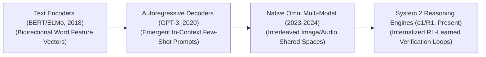

# Awesome-Foundation-Models
## Foundation Models in AI: History, Progression, Variants, & Applications

A **Foundation Model**—formally conceptualized by the Stanford Institute for Human-Centered Artificial Intelligence (HAI) in 2021—is an architectural paradigm in artificial intelligence denoting a massive neural network trained on broad, web-scale uncurated data (typically via self-supervised learning) that can be adapted to a vast spectrum of downstream cognitive and physical tasks. 

Prior to the foundation model era, the artificial intelligence ecosystem was characterized by **Narrow Task-Specific Paradigms**, where separate models had to be engineered and trained from scratch for individual applications (e.g., one model for translation, another for sentiment). Foundation models broke this fragmented approach: by scaling transformer parameters and data token volumes, these models display emergent general properties, acting as an upstream centralized infrastructure layer that can be customized via minor post-training fine-tuning or in-context prompting.

---

## 1. The Macro Chronological Evolution

The architectural scaling of foundation networks has transitioned from early text-only encoder representations to autoregressive decoders, multi-modal patch arrays, and native reinforcement-learned System 2 thinking engines.

*   **The Bidirectional Text Encoder Era (BERT / ELMo, ~2018–2020)**
    *   *Concept:* The structural baseline of foundation transfer learning [INDEX: 1]. Models like Google's **BERT (2018)** used masked language modeling over massive text corpuses [INDEX: 1]. The hidden layers learned bidirectional feature representations, which were then copied and fine-tuned over separate task heads for sentiment classification or question answering.
    *   *Limitation:* Rigid and bound to task-specific parameter extensions. The models were fundamentally incapable of fluid, open-ended natural conversation or generic zero-shot task scaling.
*   **The Autoregressive Generative Scale Era (GPT-3, 2020–2022)**
    *   *Concept:* Established the dominance of power-law pre-training scaling laws [INDEX: 15]. Popularized by OpenAI's **GPT-3 (2020)**, it proved that expanding parameters to hundreds of billions of channels unlocked the emergent property of **In-Context Learning (ICL)** [INDEX: 11, 15]. Instead of modifying weights via training gradients, a frozen decoder model could solve novel tasks on-the-fly simply by reading a few text examples inside the prompt window [INDEX: 11].
    *   *Limitation:* Bound by the "System 1 Intuition Wall." Autoregressive next-token prediction operates under a constant-time computational limit per token, rendering models prone to persistent, confident logical hallucinations under stress [INDEX: 1].
*   **The Native Omni Multi-Modal Era (~2023–2024)**
    *   *Concept:* Transformed foundation systems from single-sensory text strings into omnidirectional processing engines [INDEX: 1]. Models like **GPT-4o** and **Gemini 1.5** completely discarded separate auxiliary projection models. They collapse text tokens, 2D visual pixel patches [INDEX: 5], and discrete audio codebooks into a single, unified autoregressive transformer workspace concurrently [INDEX: 1].
    *   *Significance:* Unlocked native cross-modal reasoning [INDEX: 1]. Because all modalities share a single latent hypersphere, cross-sensory interactions occur instantly without the processing latencies or error cascades of intermediate text transcription steps [INDEX: 1].
*   **The Reinforcement-Learned Search & System 2 Era (~2024–Present)**
    *   *Concept:* The modern state-of-the-art foundation standard. Ported scaling laws out of static pre-training data volumes and straight into inference-time scaling parameters (test-time compute scaling) [INDEX: 1, 15]. Pioneered by systems like OpenAI’s o-series and DeepSeek-R1 [INDEX: 18, 21].
    *   *Significance:* Implements internalized **System 2 thinking** via large-scale on-policy Reinforcement Learning (RL) [INDEX: 16, 21]. The model allocates compute to generate a verbose, hidden "thinking trace" before delivering its final response, learning to execute self-correction, test mathematical identities, and backtrack from uncompilable code logs natively [INDEX: 1, 17].

---

## 2. Core Functional & Architectural Variants

Foundation Models are strictly categorized based on the underlying transformer topologies they use to route and process sequence parameters.

- ### A. Encoder-Only Foundation Models (Bidirectional Context)
	*   **Mechanism:** Employs bidirectional self-attention mechanisms to allow every token to look at every other token simultaneously across a sequence [INDEX: 1]. Optimized via masking tasks where the network must fill in missing blanks [INDEX: 1].
	*   **Pros:** Exceptional for information extraction, dense feature engineering, and classification lookups.
	*   **Examples:** BERT, RoBERTa, DeBERTa [INDEX: 1].

- ### B. Decoder-Only Foundation Models (Autoregressive Generative)
	*   **Mechanism:** Enforces an absolute causal lower-triangular attention mask, blocking tokens from ever peeking at future answer strings. It functions as a next-token prediction engine, scaling capabilities via auto-regressive context expansion.
	*   **Examples:** Llama 3, GPT-4, Mistral, Qwen [INDEX: 15].

- ### C. Encoder-Decoder Foundation Models (Sequence-to-Sequence)
	*   **Mechanism:** Combines a bidirectional encoder (processing an input prompt context) with a causally masked decoder via cross-attention layers [INDEX: 1].
	*   **Pros:** The standard configuration for high-fidelity translation, sequence summarization, and conditional structural modifications.
	*   **Examples:** T5, BART, Flan-T5 [INDEX: 1].

- ### D. Sparsely Routed Mixture-of-Experts (Sparse MoE)
	*   **Mechanism:** Decouples total parameter capacity from active token compute costs [INDEX: 15]. It splits internal Feed-Forward Network (FFN) layers into multiple independent parallel sub-networks (Experts) [INDEX: 15]. A fast routing gate dispatches tokens selectively to only 1 or 2 experts, letting a model hold hundreds of billions of parameters on disk while keeping active inference latencies small [INDEX: 15].
	*   **Examples:** DeepSeek-V3, Mixtral 8x22B [INDEX: 15].

---

## 3. High-Capacity Architectural & Memory Components

To serve and scale massive foundation models over long text and multimodal contexts, enterprise deployment platforms orchestrate hardware-fused caching infrastructures [INDEX: 22].

*   **Multi-Head Latent Attention (MLA Cache Compression)**
    *   *Profile:* Slashes inference VRAM overheads [INDEX: 18]. Autoregressive token decoding requires caching historical Key-Value (KV) attention vectors to prevent redundant math [INDEX: 22]. MLA mathematically compresses these cache dimensions down into a highly dense, low-rank latent vector *before* memory storage occurs, slashing total cache footprints by up to 93% [INDEX: 18].
*   **PagedAttention Virtual Block Managers**
    *   *Profile:* Fully eliminates VRAM memory fragmentation [INDEX: 22]. Adapting virtual memory paging from operating systems, it chunks the KV cache into fixed, non-contiguous physical memory pages [INDEX: 22]. A block table maps logical inputs to disjointed physical coordinates on-the-fly, allowing cloud servers to multiply active multi-user concurrency batches [INDEX: 22].

---

## 4. Production Engineering Challenges & Mitigations

Deploying and maintaining foundation systems across large distributed high-performance computing clusters introduces severe data walls and alignment trade-offs.

*   **The Data Wall Constraint & Synthetic Curation Loops**
    *   *The Problem:* Compute-optimal pre-training scaling laws (Chinchilla metrics) dictate that expanding parameter size requires scaling dataset token volume in equal 1:1 proportions [INDEX: 15]. As models hit multi-trillion token milestones, the entire available matrix of clean, human-written text on the public internet becomes fully exhausted, threatening to halt model progression.
    *   *Mitigation:* Implementing **Self-Instruct Generative Curation loops**, using frontier reasoning models to synthesize and mutate millions of alternative mathematical proofs, Python traces, and high-rank textbook scenarios, scaling dataset token ingestion with verified synthetic assets.
*   **The "Alignment Tax" & Pareto Optimization Dilemma**
    *   *The Problem:* Hardening models against systemic exploits via aggressive preference alignment (RLHF/DPO) can cause hidden layers to over-correct [INDEX: 11, 16]. The network over-generalizes safety masks, resulting in severe capability dropouts where it refuses benign analytical data queries because it flags generic vocabulary words erroneously.
    *   *Mitigation:* Bypassing macro parameter overrides by deploying overcomplete **Sparse Autoencoders (SAEs)** [INDEX: 2]. SAEs isolate abstract conceptual directions into distinct monosemantic feature channels [INDEX: 2], letting trust and safety modules precisely inject activation steering vectors at runtime to neutralize authentic hazards without inducing collateral feature degradation [INDEX: 2].

---

## 5. Frontier Real-World AI Industrial Applications

*   **Long-Horizon Software Engineering & Repository Orchestration**
    *   *Application:* Drives automated software developer platforms (such as Devin or Cascade architectures) [INDEX: 22]. Inference-time search scaling and tool-augmented scaffolding allow the foundation model to treat code tickets as an active debugging loop: reading file structures, generating patches, analyzing compiler errors inside local sandboxes, and refactoring scripts recursively until all unit tests pass [INDEX: 1, 12, 17].
*   **Spatio-Temporal Video Generative Flow-Matching Simulators**
    *   *Application:* Drives next-generation advanced cinematic pre-visualization and industrial simulation loops. Spatio-temporal foundation transformers treat video frames as 3D token cubes; the model removes noise across these cubes concurrently, predicting straight-line trajectories to generate physically consistent multi-second video animations smoothly.
*   **Mission-Critical Legal & Financial Forensic Auditing Workflows**
    *   *Application:* Reviews multi-departmental corporate profiles and intricate litigation records [INDEX: 1]. Long-context foundation decoders parse text-dense PDFs, multi-axis charts, and structural blueprints concurrently, using interleaved retrieval-augmented reasoning to catch hidden corporate liability exposure or regulatory variances automatically [INDEX: 1, 18].

---

## References
1. Vaswani, A., et al. (2017). Attention is all you need: Foundational transformer matrix blocks. *Advances in Neural Information Processing Systems (NeurIPS)*, 30 [INDEX: 1].
2. Devlin, J., et al. (2018). BERT: Pre-training of deep bidirectional transformers for language understanding. *arXiv preprint arXiv:1810.04805* [INDEX: 1].
3. Brown, T., et al. (2020). Language models are few-shot learners: In-context learning scaling frontiers. *Advances in Neural Information Processing Systems (NeurIPS)*, 33, 1877-1901 [INDEX: 11, 15].
Bommasani, R., et al. (2021). On the opportunities and risks of foundation models. Stanford Institute for Human-Centered Artificial Intelligence (HAI) Whitepaper.Kwon, W., et al. (2023). Efficient virtual memory management for long-context language model serving loops via pagedattention block routing. vLLM Open-Source Infrastructure Framework Manual [INDEX: 22].DeepSeek-AI. (2025). DeepSeek-V3 Technical Report: Multi-head latent parallel attention and sparse expert scaling protocols over distributed hardware clusters. GitHub Repository Technical Infrastructure Manifesto [INDEX: 15, 18].To advance this documentation repository, foundation structural setup, or distributed deployment blueprint, consider exploring these adjacent development pathways:Build a Python script using PyTorch and the Hugging Face Transformers library illustrating how to load an open-weight foundation model, configure a LoRA adapter graph, and execute parameter-efficient fine-tuning over a localized task dataset.Generate a comprehensive Markdown table explicitly comparing Encoder-Only, Decoder-Only, Encoder-Decoder, and Sparse Mixture-of-Experts (MoE) foundation paradigms across active compute allocation constraints, GPU VRAM caching footprints, downstream zero-shot task alignment capacities, and optimization loss functions [INDEX: 1, 15, 22].Establish an automated performance profiling suite using Triton to track the exact computational token-per-second throughput, worker synchronization times, and memory bus bandwidth compression achieved when executing an enterprise pre-fill training pass over distributed server nodes [INDEX: 22].Follow-Up Options Matrix:Before updating this documentation repository workspace layout, let me know how you would like to proceed by choosing one of the options below:I can provide a complete Python code boilerplate using PyTorch demonstrating how to write a manual causal self-attention calculation function that handles causal sequence masking precisely [INDEX: 1].I can generate a Markdown matrix table tracking the explicit parameter footprints, active layer counts, and context windows of the leading frontier foundation models over the past 24 months.I can write a detailed technical explanation focusing on the mathematics of test-time compute scaling and how process-supervised value networks govern error backtracking inside reasoning streams [INDEX: 1, 16].
***

