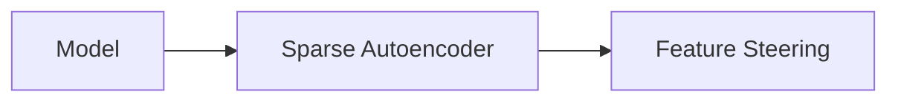

# The Alignment Tax

This page provides detailed information about The Alignment Tax.

```mermaid
graph LR
  A[Model] --> B[Sparse Autoencoder]
  B --> C[Feature Steering]
```

[Back to README](../README.md)
