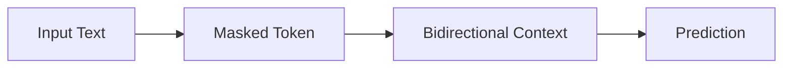

# The Bidirectional Text Encoder Era

This page provides detailed information about The Bidirectional Text Encoder Era.

```mermaid
graph LR
  A[Input Text] --> B[Masked Token]
  B --> C[Bidirectional Context]
  C --> D[Prediction]
```

[Back to README](../README.md)
