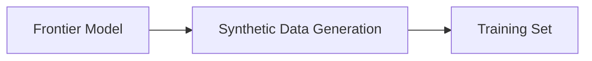

# The Data Wall Constraint

This page provides detailed information about The Data Wall Constraint.

```mermaid
graph LR
  A[Frontier Model] --> B[Synthetic Data Generation]
  B --> C[Training Set]
```

[Back to README](../README.md)
