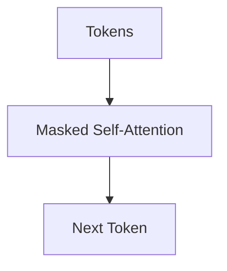

# Decoder-Only Foundation Models

This page provides detailed information about Decoder-Only Foundation Models.

```mermaid
graph TB
  A[Tokens] --> B[Masked Self-Attention]
  B --> C[Next Token]
```

[Back to README](../README.md)
