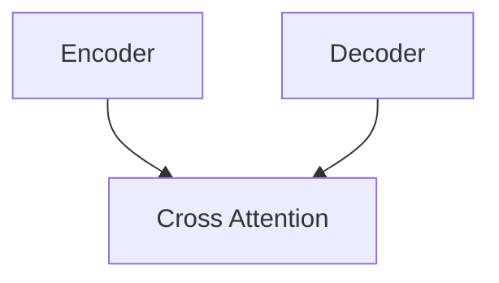

# Encoder-Decoder Foundation Models

This page provides detailed information about Encoder-Decoder Foundation Models.

```mermaid
graph TB
  A[Encoder] --> B[Cross Attention]
  C[Decoder] --> B
```

[Back to README](../README.md)
