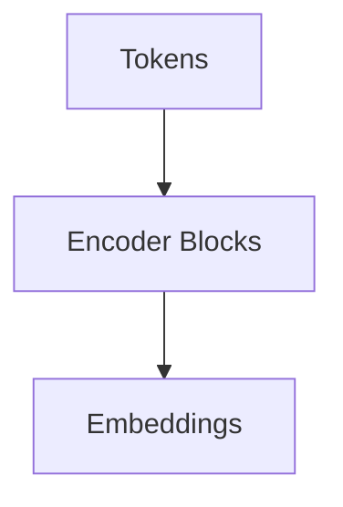

# Encoder-Only Foundation Models

This page provides detailed information about Encoder-Only Foundation Models.

```mermaid
graph TB
  A[Tokens] --> B[Encoder Blocks]
  B --> C[Embeddings]
```

[Back to README](../README.md)
