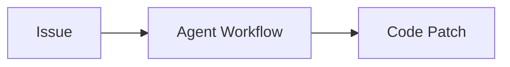

# Long-Horizon Software Engineering

This page provides detailed information about Long-Horizon Software Engineering.

```mermaid
graph LR
  A[Issue] --> B[Agent Workflow]
  B --> C[Code Patch]
```

[Back to README](../README.md)
