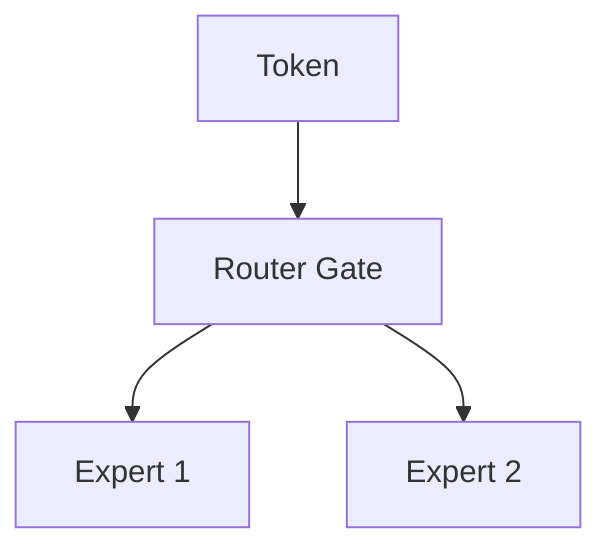

# Sparsely Routed Mixture-of-Experts

This page provides detailed information about Sparsely Routed Mixture-of-Experts.

```mermaid
graph TB
  A[Token] --> B[Router Gate]
  B --> C[Expert 1]
  B --> D[Expert 2]
```

[Back to README](../README.md)
